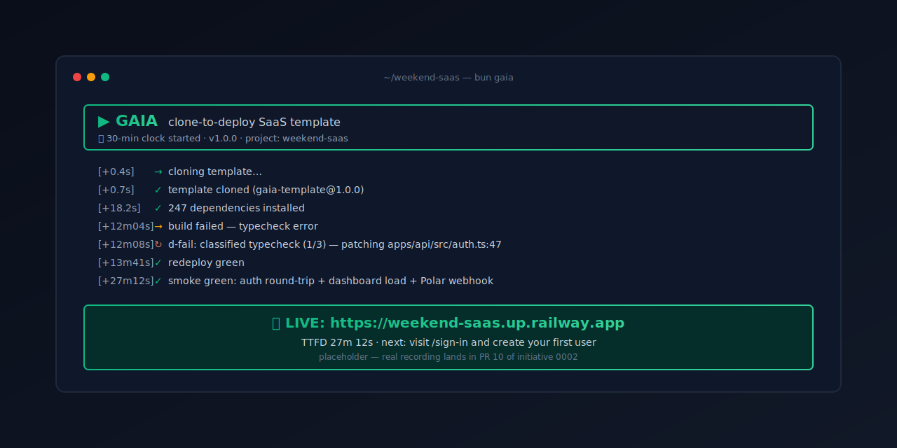

# Gaia

[](https://github.com/henriquemeireles7/gaia/actions/workflows/ci.yml) [](./LICENSE) [](https://claude.com/claude-code) [](https://bun.sh)

> **Clone, install, deploy. Live URL in <30 minutes.** $0 to start. 4 free-tier vendor accounts. Your AI agent does the rest.

Gaia is an MIT TypeScript SaaS template for the agent-native era. Auth, billing, deploy, and an agent harness are wired and tested. The CLI narrates every step in real time — your AI agent watches the same stream you do, and `d-fail` self-heals when a deploy breaks.

The Rails of TypeScript, redesigned for a world where agents write most of the code.



## Quick start

```bash
bun create gaia-app@latest myapp
cd myapp
bun gaia setup            # walks you through Polar / Resend / Neon / Railway signup
                          # see docs/getting-started.md (or `--ci` to skip prompts)
bun gaia deploy && bun gaia smoke
```

That's it. `setup` walks you through pasting Polar / Resend / Neon / Railway tokens (or type `open` to launch the signup page). `deploy` runs preflight, ships to Railway, and self-heals via `d-fail` if the build breaks. `smoke` confirms auth + billing webhooks + dashboard load. You watch a green ASCII banner, a stream of timestamped events, and — at minute 28 or so — your live URL.

Prereqs: macOS or Linux, Bun ≥1.2, git, optional [`gh`](https://cli.github.com) and [Claude Code](https://claude.com/claude-code).

## What you get

| Surface       | Out of the box                                                                                          | You customize                              |
| ------------- | ------------------------------------------------------------------------------------------------------- | ------------------------------------------ |
| Auth          | Better Auth — email/password, verify email, password reset, optional Google OAuth                       | Add MFA, SSO, additional providers         |
| Billing       | Polar checkout (merchant-of-record), customer portal, webhook → DB → entitlement gating                 | Plans, pricing, billing UI                 |
| Deploy        | Railway one-click + agent-native CLI (`bun gaia verify-keys / deploy / smoke`) with `d-fail` self-heal  | Custom regions, Cloudflare scale migration |
| Agent harness | 18 skills, fractal `CLAUDE.md`, typed CLI protocol, NDJSON event stream, `.gaia/rules.ts` policy source | Your own skills + reference files + rules  |
| Observability | OpenTelemetry → Axiom; Sentry errors; PostHog product events — wired at boot                            | Custom dashboards, alerts, sampling        |

## Stack

| Layer           | Choice                                                                                    |
| --------------- | ----------------------------------------------------------------------------------------- |
| Runtime         | [Bun](https://bun.sh)                                                                     |
| Backend         | [Elysia](https://elysiajs.com)                                                            |
| Frontend        | [SolidStart](https://start.solidjs.com)                                                   |
| Type bridge     | [Eden Treaty](https://elysiajs.com/eden/treaty/overview.html)                             |
| Validation      | [TypeBox](https://github.com/sinclairzx81/typebox) via Standard Schema                    |
| Database        | [Neon](https://neon.tech) (serverless Postgres) + [Drizzle ORM](https://orm.drizzle.team) |
| Cache / KV      | [Dragonfly](https://www.dragonflydb.io)                                                   |
| Auth            | [Better Auth](https://www.better-auth.com)                                                |
| Payments        | [Polar](https://polar.sh) (merchant-of-record)                                            |
| Email           | [Resend](https://resend.com)                                                              |
| Background jobs | [iii](https://iii.dev)                                                                    |
| Analytics       | [PostHog](https://posthog.com)                                                            |
| Errors          | [Sentry](https://sentry.io)                                                               |
| Logs / traces   | [Axiom](https://axiom.co) + [OpenTelemetry](https://opentelemetry.io)                     |
| API docs        | [Scalar](https://scalar.com)                                                              |
| Linter          | [Oxlint](https://oxc.rs) + custom GritQL rules                                            |
| Formatter       | [oxfmt](https://oxc.rs)                                                                   |
| Test            | Bun test + [Playwright](https://playwright.dev) + [Stryker](https://stryker-mutator.io)   |
| Monorepo        | [Moon](https://moonrepo.dev) + [proto](https://moonrepo.dev/proto) + Bun workspaces       |
| Deploy          | [Railway](https://railway.app)                                                            |

Full vendor reasoning lives in [`.gaia/vision.md`](./.gaia/vision.md#the-stack).

## FAQ

### How much does it cost to start?

$0 to start. The template is MIT-licensed and Gaia takes nothing. You pay vendors directly (Polar, Resend, Neon, Railway) — all four have free tiers covering small projects. Polar charges only on revenue (no monthly minimum).

### Can I escape if I want to leave?

Yes. Every dependency is conventionally used, not structurally coupled. Swap any layer (auth, billing, host) by replacing one adapter under `packages/adapters/`. The harness is plain markdown + TypeScript in your git repo — fork it, delete it, ignore it. Nothing locks you in.

### What do I need installed before `bun create`?

macOS or Linux with Bun ≥1.2, git, and a Claude Code subscription (optional but recommended for self-heal). You'll create four free-tier accounts during onboarding (Polar, Resend, Neon, Railway) — `bun gaia setup` walks you through pasting tokens with browser links. Windows users: WSL2 works today; native Windows lands in v1.1.

### What happens when the deploy breaks?

The CLI invokes `d-fail`, which reads the Railway logs, classifies the failure (typecheck, missing env var, migration race, lockfile drift, webhook-signature, domain-pending, plus a surfaced-cleanly catch-all), commits a fix, and redeploys. Up to 3 attempts with exponential backoff before it surfaces the failure with a `bun gaia explain E####` link and a captured log at `.gaia/last-deploy-failure.log`.

### Will it work with Next.js or other frameworks?

No. Gaia is opinionated: Bun + Elysia + SolidStart only. The architecture assumes Eden Treaty for end-to-end types, which Next can't provide. If you want Next + Supabase, use [`create-t3-app`](https://create.t3.gg) instead.

## Repository layout

```
.
├── CLAUDE.md         # Root resolver — skills routing, docs routing, four engineering disciplines
├── .gaia/            # Methodology — vision.md, initiatives/, protocols/, rules/
├── .claude/          # Claude Code home — settings.json, hooks/, skills/ (h-* / w-* / a-* + gstack/)
├── apps/             # api/ (Elysia), web/ (SolidStart)
├── packages/         # core, config, errors, db, adapters, auth, ui, security, workflows
├── cli/              # create-gaia-app — bun gaia <verb> (initiative 0002)
├── content/          # Human-authored markdown (blog, legal, emails)
├── tools/            # ast-grep config, custom rules
├── scripts/          # Cross-file checks (test ratio, manifest, coverage audit)
├── docs/             # User-facing docs (getting-started, cli, architecture, launch, privacy)
└── .github/          # CI workflows + issue/PR templates
```

The principle: **everything Gaia-methodology lives under `.gaia/`. `.claude/` holds only what Claude Code natively reads.** Local conventions live in folder-level `CLAUDE.md` files (auto-loaded by hook); the file system is the index — no hand-maintained manifest.

## Documentation

- [Vision](./.gaia/vision.md) — the locked Gaia v7 spec.
- [Initiatives](./.gaia/initiatives/CLAUDE.md) — current strategic bets (5-row index).
- [Skills](./.claude/skills/) — 18 `d-*` skills + vendored gstack. Each ships with `SKILL.md` + `reference.md`.
- [Permissions](./.gaia/protocols/permissions.md) — what's always-allowed / requires-approval / never-allowed.

## Scripts

| Command               | Description                                                            |
| --------------------- | ---------------------------------------------------------------------- |
| `bun run dev`         | API dev server with hot reload (run `bun run dev:web` in another tab). |
| `bun run check`       | Full pipeline (lint + types + harden + scripts + test). Pre-commit.    |
| `bun run lint`        | Auto-fix lint issues.                                                  |
| `bun run db:migrate`  | Run database migrations.                                               |
| `bun run db:generate` | Generate a new migration from `packages/db/schema.ts`.                 |
| `bun run db:studio`   | Open Drizzle Studio.                                                   |

## Status

**v1 — pre-launch.** See [`.gaia/initiatives/CLAUDE.md`](./.gaia/initiatives/CLAUDE.md) for the current 5-row index of strategic bets. The CLI (`bun create gaia-app@latest`) ships in initiative 0002.

## License

MIT. See [LICENSE](./LICENSE).
